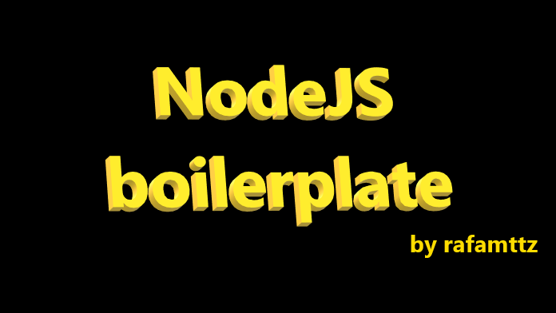

  

# Node repository with code snippets applying different features.

## How it's organized?
Each directory represents a different issue. The current issues are:
- calculator/ : operators
- mysql/ : how to use Mysql with JS
- mongo/ : how to use MongoDB with JS

## How to collaborate?

It's easy! Follow the these steps:
1. Fork this repo.
2. Create a new directory with the name of the issue and fill it.
3. Commit your stuff and open a PR!